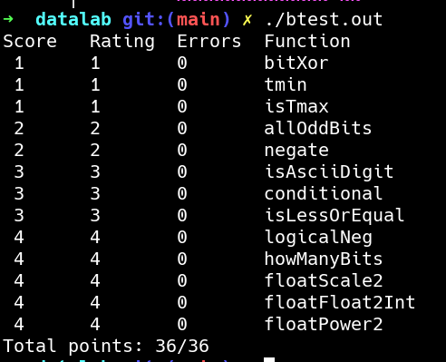

## DATALAB 解析
1.  bitXor - x^y using only ~ and & .

用 `~` 和 `&` 实现 `^`：
通过如下图所示：


`x^y = x|y-x&y`  已知  `a-b=a&(~b)` 所以可得

`x^y = (x|y)&~(x&y)`

又通过[德摩根定律](https://en.wikipedia.org/wiki/De_Morgan%27s_laws)，可得

`x^y=~(~x&~y)&~(x&y)`

```c
int bitXor(int x, int y) {
  return ~(~x&~y)&~(x&y);
}
```

2.  tmin - return minimum two's complement integer 

返回二进制补码的最小值，即为，符号位为 `1` ，其他位全为 `0`的数。

```c
int tmin(void) {
  return 1<<31;
}
```

3. isTmax - returns 1 if x is the maximum, two's complement number,

判断x是否为二进制补码形式的最大值

二进制补码的最大值为符号位为 `0` ，其他位全为 `1` 的数。
在8位情况下：最大值为 `0111 1111`，可以观察到 `x+1 ` 为 `1000 0000` 对其取反即可得到 `0111 1111`，所以最大值存在 `x==~(x+1)` 的性质。下面的问题是如何表示 `==`：显然 `x==y` 可以等价与 `~(x^y)`。这样，我们便得到了判断 `x` 是否为最大值的语句 `~(x^(~(x+1)))` ,但是很可惜 `-1(1111 1111)` 对于上面的式子也成立，但是 `-1+1=0`而最大值`x+1!=0`，这样便可以区分 `-1` 和最大值 `x` 。

```c
int isTmax(int x) {
  return (!(~(x+1)^x))&!(x+1);
}
```

4. allOddBits - return 1 if all odd-numbered bits in word set to 1

这个只需构造出一个特殊值`A=1010 1010 1010 1010 1010 1010 1010 1010 =0xAAAAAAAA`，`x&A==A`即可解决问题。

```c
int allOddBits(int x) {
  int b = (0xAAAA<<16)|0xAAAA;
  return !((x&b)^b);
}
```

5. negate - return -x 

`x+~x=-1` `x+(-x) = 0`所以`-x = ~x+1`

```c
int negate(int x) {
  return ~x+1;
}
```

6. isAsciiDigit - return 1 if 0x30 <= x <= 0x39 (ASCII codes for characters '0' to '9')

判断 `x` 是否为 `Ascii` 里面 '0'-'9' 的值。
首先判断高四位是否为 `0011`，即判断`x>>4==0x3`

再判断低四位是否为 `0000-1001` 之间，令低四位的值为`y`,这里通过判断 `9-y`是否为非负数来判断，非负数的判断只需判断符号位是否为`1`即可。

两次判断同时成立时，返回1。

```c
int isAsciiDigit(int x) {

   int up = !((x>>4)^0x3);
   int y = ~(x&0xF)+1;
   int sign = !((y+0x9)&1<<31);
   return up&sign;
}
```

7.  conditional - same as x ? y : z 

这里判断`x`是否为`0`。`x` 为 `0` 时，令 `t=0xFFFFFFFF,s=0` `x` 不为 `0` 时，令 `s=0xFFFFFFFF,t=0`。
这里认为右移为算数右移。

```c
int conditional(int x, int y, int z) {
  int t = ((!x)<<31)>>31;
  int s = ((!t)<<31)>>31;
  return (s&y)|(t&z);
}
```

8.  isLessOrEqual - if x <= y  then return 1, else return 0 

基本思想是判断 `y-x>=0`,但有可能超出 `int` 的范围，具体分析是如果 `x<0&&y>0` 和 `x>0&&y<0` 这两种情况下可能溢出。
所以需要一个变量来记录`x,y` 是否异号，如果异号且 `x<0` 那么肯定返回 `1`，异号且`x>0` 肯定返回 `0`

```c
int isLessOrEqual(int x, int y) {
  int diff_sign = (x>>31&0x1)^(y>>31&0x1);
  int a = diff_sign&(x>>31&0x1);//异号且x<0,为1，异号且x>0 为0
  int b = !diff_sign&!((~x+1+y)>>31&0x1);//异号肯定为0，同号不会产生溢出，得到正确结果。
  return a|b;
}
```

9.  logicalNeg - implement the ! operator

利用`-0=0`,除了 `0` 之外，其他数取相反数会变号。

```c
int logicalNeg(int x) {
    int c1 = x>>31&0x1;
    int c2 = ((~x+1)>>31)&0x1;
    return !(c1|c2);
}
```

10.  howManyBits - return the minimum number of bits required to represent x in two's complement

```c
int howManyBits(int x) {
  int b16,b8,b4,b2,b1,b0;
    int flag=x>>31;
    x=(flag&~x)|(~flag&x); 
    b16=!!(x>>16) <<4; 
    x>>=b16; 
    b8=!!(x>>8)<<3;
    x >>= b8;
    b4 = !!(x >> 4) << 2;
    x >>= b4;
    b2 = !!(x >> 2) << 1;
    x >>= b2;
    b1 = !!(x >> 1);
    x >>= b1;
    b0 = x;
  return b0+b1+b2+b4+b8+b16+1;
}
```

11. floatScale2 - Return bit-level equivalent of expression 2*f for floating point argument f.


第一步是区分`sign,exp,frac`, 通过简单的移位和与运算即可得到。


第二步是判断f是否为 `NAN`，规格化数，非规格化数，通过对 `exp` 的判断来判别。

- 对于`NAN`,返回 `uf`，对于无穷大，也返回 `uf`
- 对于规格化数，只需简单的将`exp+1`
- 对于非规格化数，需要将 `uf`左移1位。

```c
unsigned floatScale2(unsigned uf) {
  int sign = (uf>>31)&0x1;
  int exp = (uf>>23)&0xFF;
  int frac = uf&0x7FFFFF;
  if(exp==0xFF) return uf;
  else if(exp == 0){
    frac<<=1;
    return (sign<<31)|(exp<<23)|frac;
  }else{
    exp++;
    return (sign<<31)|(exp<<23)|frac;
  }
}
```

12.  floatFloat2Int - Return bit-level equivalent of expression (int) f for floating point argument f.
`int(f)` 直接取整，所以只需将f的整数部分计算得到即可，需要注意的是超出 `int` 的返回 ` 0x80000000u`

首先还是需要得到 `sign,exp,frac` 的值，

$$f= (-1)^s*M*(2)^E$$
其中 $E=exp-127，M=1.frac$

所以分类讨论得：
- `E<0` 返回0
- `E>31`,超出 `int` 的范围，返回 ` 0x80000000u`
- `0<=E<=31`,需要判断 `frac` 左移还是右移的位置，如果`E>=23`,`frac` 的全部位于小数点之前，所以需要左移`E-23`位，如何`E<23`,需要右移 `23-E` 去掉小数点后的精度。

```c
int floatFloat2Int(unsigned uf) {
  int sign = (uf>>31)&0x1;
  int exp = (uf>>23)&0xFF;
  int frac = uf&0x7FFFFF;
  int E = exp-127;
  if(E<0) return 0;
  else if(E>=31)  return 0x80000000u;
  else{
    frac = frac|1<<23;
    if(E>=23){
      frac = frac<<(E-23);
    }else{
      frac = frac>>(23-E);
    }
  }
  if(sign)
    return -frac;
    else
      return frac;
}
```

13.   floatPower2 - Return bit-level equivalent of the expression 2.0^x for any 32-bit integer x.


对于非规格化数而言，最小能表示的值约为$2^{-149}$，最大能表示的值为$2^{-126}$,对于规约数而言，最大能表示的值为$2^{127}$
- `x<-148` 返回 0；
- `x>127` 返回正无穷
- `-148<=x<-126` 使用非规格化数表示
- `-126<=x<127`使用规格化数表示

由于得到的结果为$2^x$,所以再规格化数中，frac 全为0

```c
unsigned floatPower2(int x) {
  if(x>127) return 0xFF<<23&(~0X10);
  else if(x<-148) return 0;
  else if(x>=-126){
    int exp = x+127;
    return exp<<23;
  }else{
    int frac = 149+x;
    return 1<<frac;
  }
}
```

最后结果



